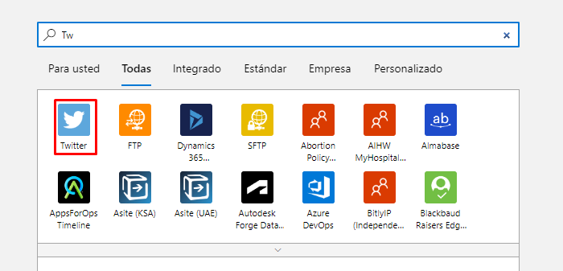
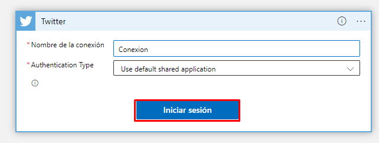
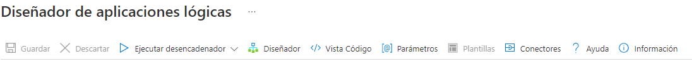
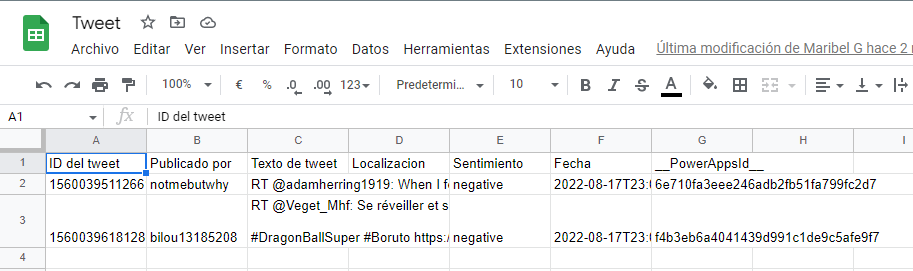
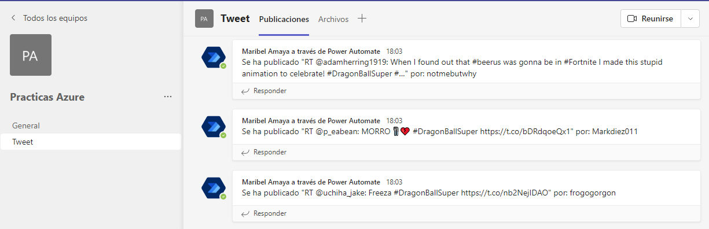

# Practica 6 con "Azure Logic"

*Analizar tweets con Azure Logic*

**Paso 1 _Functions_**
- Poner en la barra de busqueda "logic" y elegir la opcion de "logic apps"

**Paso 2 _Crear App logic_**
- Primero debemos elegir el boton "Crear" 

- Ir a datos basicos
  

  - Debemos elegir en detalles del proyecto:
      - La suscripcion
      - El grupo de recursos previamente creado
      

  - Debemos elegir en detalles de instancia:
      - Nombre con el que queremos llamar la aplicacion
      - La region donde deseamos crearla
      - Elegir si habilitar Log Analytics
      

  - Debemos elegir el tipo de plan
      
  - Debemos elegir en Redundancia de zona
        

- Dar en revisar y crear
  

- Dar en crear e ir al recurso
  

- Crear una aplicacion logica en blanco
    

- Buscar y elegir Twitter. Posteriormente presionar en cuando se publica un nuevo tweet
    

- Iniciar sesión en twitter
    

- LLenar el formulario con los datos correspondientes 
  - Texto de busqueda (poner el # que queremos analizar)
  - Especificar el intervalo de tiempo con el que queremos que analice (en este caso cada 5 seg)

  - Al finalizar dar en nuevo paso

- Ingresamos en el buscador la palabra "text" y elegimos Azure cognitive

- Despues elegimos sentimientos

>Nota: Ir al paso 3 cognitive services

- Pegamos la clave y la url del paso 3 en nuestro formulario, por ultimo damos en crear

- A continuacion deberemos poner un id al documento que corresponde al tweet y despues decir lo que se analizara que en este caso sera el texto para despues dar en agregar una accion

- Buscamos la hoja de calculo de google y elegimos insertar fila

- Iniciamos sesión en google

- Elegimos una hoja de calculo creada previamente en google drive, a continucacion ligamos cada fila con su contenido y agregamos un paso

- Escogemos la opcion "publicar mensaje en un chat o  canal" e iniciamos sesión en nuestro teams

- LLenamos las casillas correspondientes y guardamos lo que hemos realizado

>Nota: Ir al paso 4

      
**Paso 3 Cognitive services**
- Poner en la barra de busqueda "cognitive services" y elegir la opcion 

- Crear un servicio de lenguaje
  

  - Debemos elegir en detalles del proyecto:
      - La suscripcion
      - El grupo de recursos previamente creado
      
  - Debemos elegir en detalles de instancia:
      - Nombre 
      - La region donde deseamos crearla
      - Plan de tarifa
      
    
- Dar en revisar y crear, finalmente creamos 
  

- Vamos a claves y puntos de conexion
  

- Copiamos la primera clave y la url, despues regresamos al paso 2
  

**Paso 4 Parte final**
- Una vez guardado la ultima parte del paso 2 dar en ejecutar encadenador

- Al checar excel podemos observar el resultado de nuestro analisis

- Al checar Teams tambien podemos observar el resultado de nuestro analisis

